<div align="center">


# COMMONS

### The operating system for community attention.

**AI civic intelligence that finds the problems hidden *between* the reports —
the quiet, dangerous issues a community has not started paying attention to yet.**

[](https://commons-33047220516.asia-southeast1.run.app)
&nbsp;

&nbsp;

&nbsp;


🔗 **[commons-33047220516.asia-southeast1.run.app](https://commons-33047220516.asia-southeast1.run.app)**

</div>

---

## The one-sentence pitch

> Communities don't fail from **under-reporting**. They fail from **fragmented
> attention** — the loudest complaint is rarely the most dangerous one, and the
> dangerous one stays invisible until it's a disaster.

A pothole gets fifty angry upvotes. Two streets away, a choked stormwater drain
near a lake — the one that will flood homes next monsoon — sits with two quiet
reports and no upvotes. Every civic dashboard ranks by volume, so the pothole
wins and the drain is invisible.

**COMMONS measures danger and loudness separately, and surfaces the gap.**

---

## See it

> A dense residential ward in Bengaluru, India — **HSR Layout (BBMP Ward 174)**,
> 63,033 residents — is the worked example throughout.

### 1 · The Contradiction Engine

The core view: every problem plotted by **Impact** (how dangerous) against
**Attention** (how loud). The amber top-left quadrant — high impact, low
attention — is where the **Hidden Crises** live.

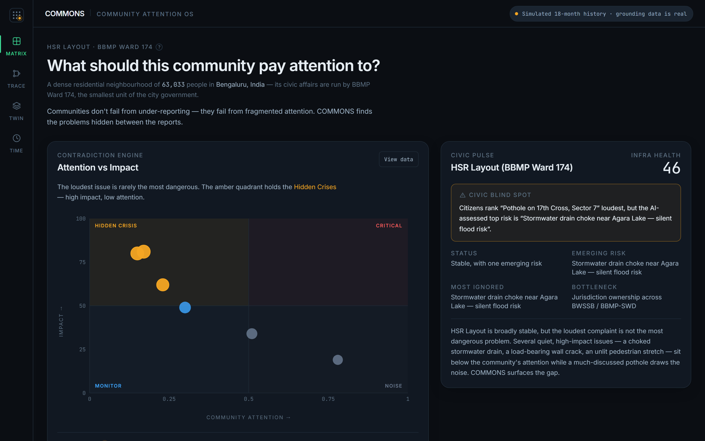

The same data, as a native chart — the drain (impact 81) sits far from the crowd,
while the pothole (impact 19) soaks up the attention:

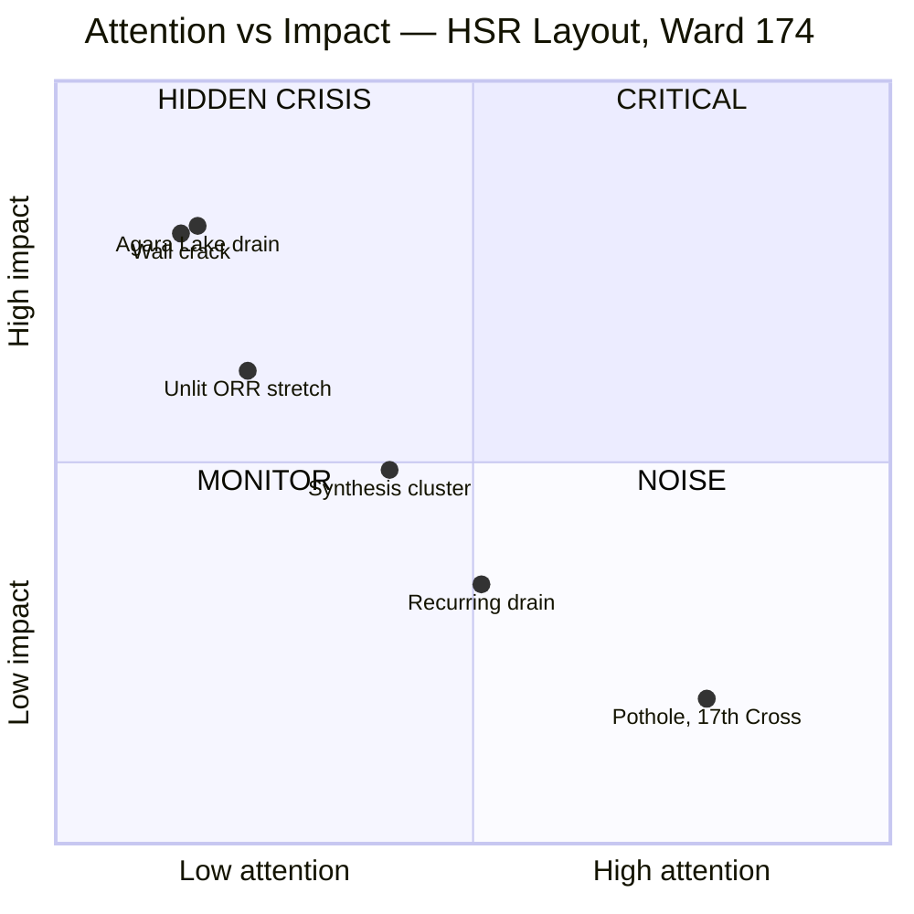

> The pothole is alone in **NOISE** (loud, low impact). Three problems sit silent
> in **HIDDEN CRISIS** (dangerous, ignored). That gap is the product.

### 2 · The overrule, made auditable

Open any problem and the Impact score breaks down into its real, cited factors —
and where the AI overruled the crowd:

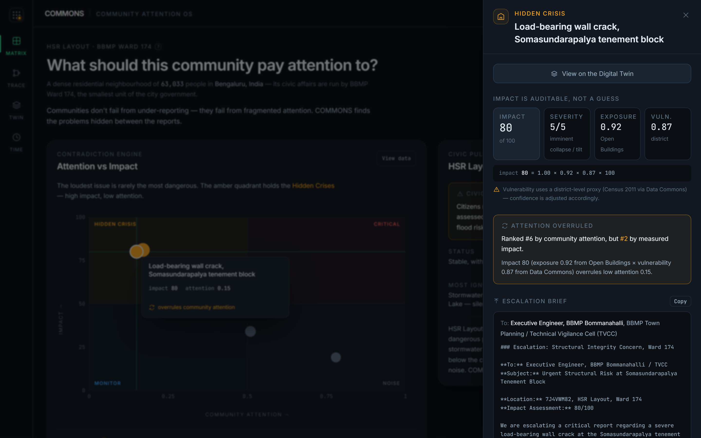

### 3 · Seven agents you can watch think

The **Trace** view explains the entire system in plain language, then lets you
click into any single agent step to see exactly what it received, what it did,
and why to trust it:

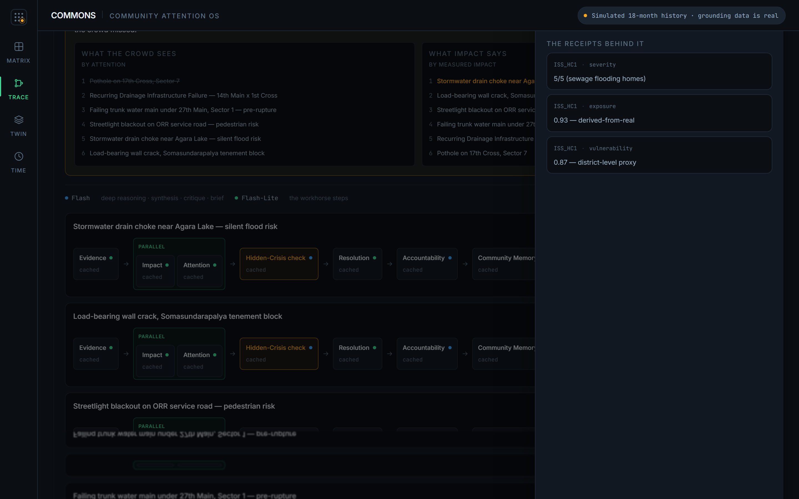

Flip on **Explain Mode** and every problem's reasoning expands inline, with the
overrule laid out crowd-vs-impact:

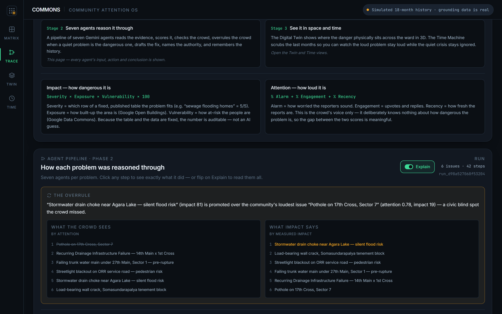

### 4 · The Digital Twin

The ward in 3D. Each column is a ~275 m grid cell; height = built exposure
(Google Open Buildings); colour = the quadrant of its worst problem. The amber
columns *are* the hidden crises, in space:

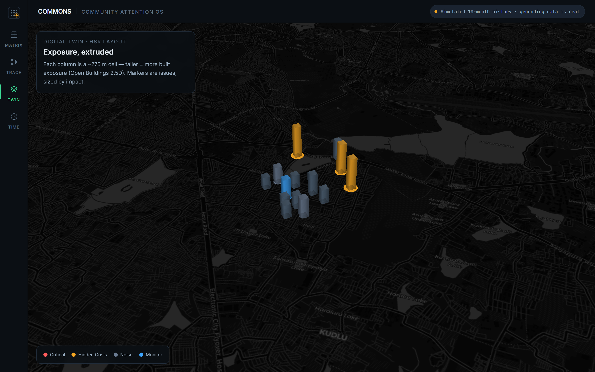

### 5 · The Time Machine

Scrub the last months and watch the contradiction unfold over time — the
pothole's attention climbs loud while the drain stays high-impact and ignored:

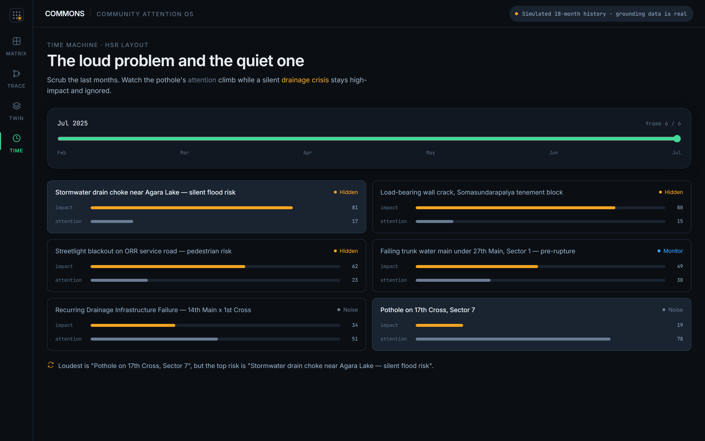

---

## How it works — four stages

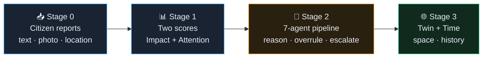

| Stage | What happens | Where to see it |
|-------|--------------|-----------------|
| **0 · Reports** | Citizens report problems with text, a photo, and a Plus Code location. | `/api/reports` |
| **1 · Two scores** | Each problem gets an **Impact** score (real data) and an **Attention** score (the crowd). | Matrix view |
| **2 · Seven agents** | A Gemini pipeline reasons each problem through, end to end. | Trace view |
| **3 · Space & time** | A 3D Digital Twin and a snapshot Time Machine make impact tangible. | Twin & Time views |

---

## The seven agents

The pipeline runs per problem. **Impact and Attention run in parallel** — and the
Hidden-Crisis agent is the one that overrules the crowd.

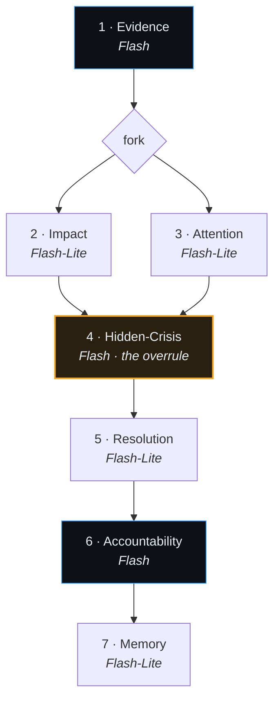

| # | Agent | What it does | Model |
|---|-------|--------------|-------|
| 1 | **Evidence** | Reads the reports and photos; names the real problem. | Flash |
| 2 | **Impact** | Computes Severity × Exposure × Vulnerability — and asserts it. | Flash-Lite |
| 3 | **Attention** | Computes the community-attention signal — and asserts it. | Flash-Lite |
| 4 | **Hidden-Crisis** | Compares the two; **overrules the crowd** when a quiet problem is the dangerous one. | Flash |
| 5 | **Resolution** | Drafts the fix: steps, department, SLA, cost band. | Flash-Lite |
| 6 | **Accountability** | Names the exact authority; writes a ready-to-send escalation brief. | Flash |
| 7 | **Memory** | Builds the occurrence timeline and recurrence narrative. | Flash-Lite |

### The overrule, as a conversation

This is the agentic heart — the moment the system contradicts the crowd:

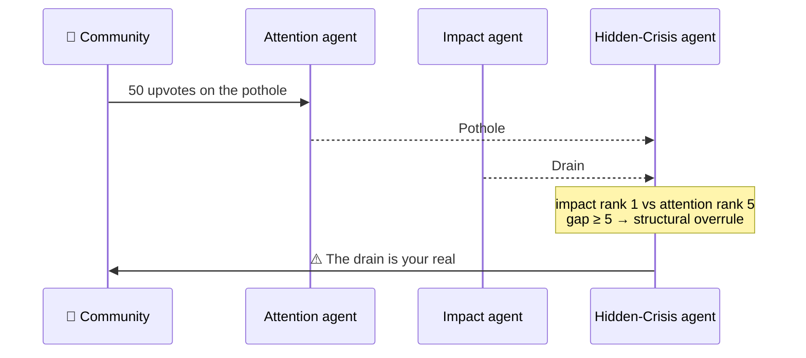

---

## The two scores, spelled out

Every number is **auditable** — reproducible from inputs, never an LLM's gut feel.

#### `Impact = Severity × Exposure × Vulnerability × 100`

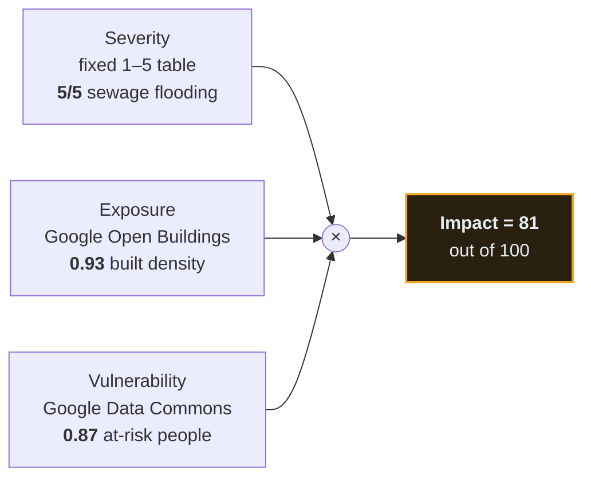

- **Severity** — which row of a fixed, published table the problem fits (e.g.
  *"sewage flooding homes"* = 5/5). A lookup, not a guess.
- **Exposure** — how built-up the area is, from **Google Open Buildings 2.5D**.
- **Vulnerability** — how at-risk the people are, from **Google Data Commons**.

Because the table and the data are fixed and inspectable, you can trace every
Impact score back to exactly where it came from.

#### `Attention = ½ Alarm + ⅓ Engagement + ⅕ Recency`

The community's voice only. It deliberately knows *nothing* about how dangerous a
problem is — which is what makes the gap between the two scores meaningful.

---

## Architecture

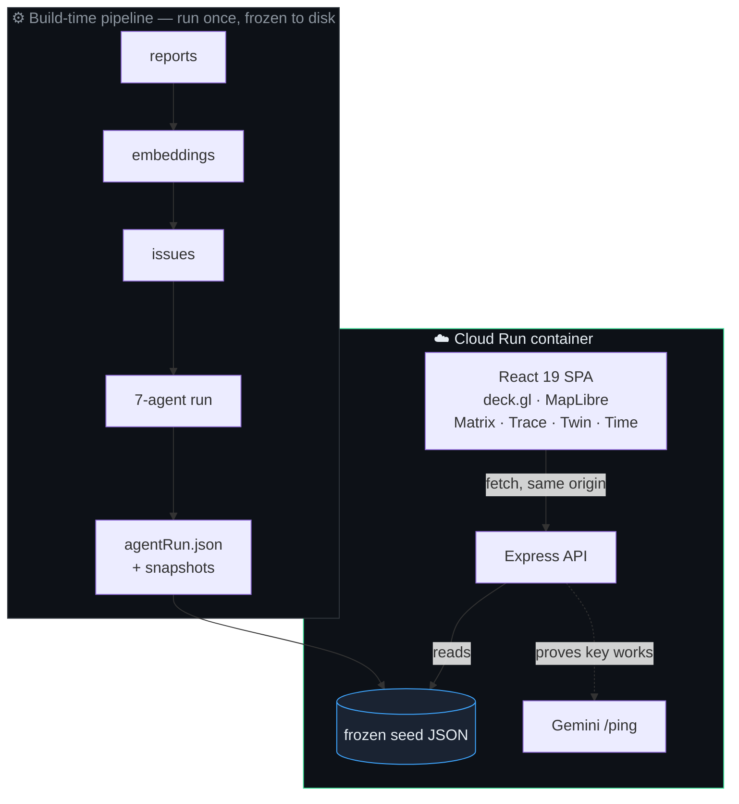

The read path is **seed-first by design**: every API response is backed by
committed JSON, so reads never depend on Firestore or Gemini being up, and the
live demo spends **≈0 API quota**. A top-level React error boundary means a
render failure degrades to a calm recovery screen — never a blank page.

---

## Built on Google technology

| Technology | Used for |
|------------|----------|
| **Google Cloud Run** | Hosting (containerized Node server + SPA). |
| **Gemini 3.5 Flash** | The reasoning steps — evidence, critique, escalation prose. |
| **Gemini 3.1 Flash-Lite** | The high-volume workhorse steps. |
| **gemini-embedding-001** | Clustering reports into issues (3072-dim). |
| **Google Open Buildings 2.5D** | The Exposure factor (built density + height). |
| **Google Data Commons** | The Vulnerability factor (census deprivation proxy). |
| **Google Plus Codes** | The ~275 m grid cell — the spatial join key. |
| **Gemma** | RPD-wall fallback model (separate free-tier pool). |
| **A2A** | The pipeline is discoverable at `/.well-known/agent.json`. |

---

## Honesty: synthetic data & provenance

This is a hackathon demo, and it is **explicit about what is real**:

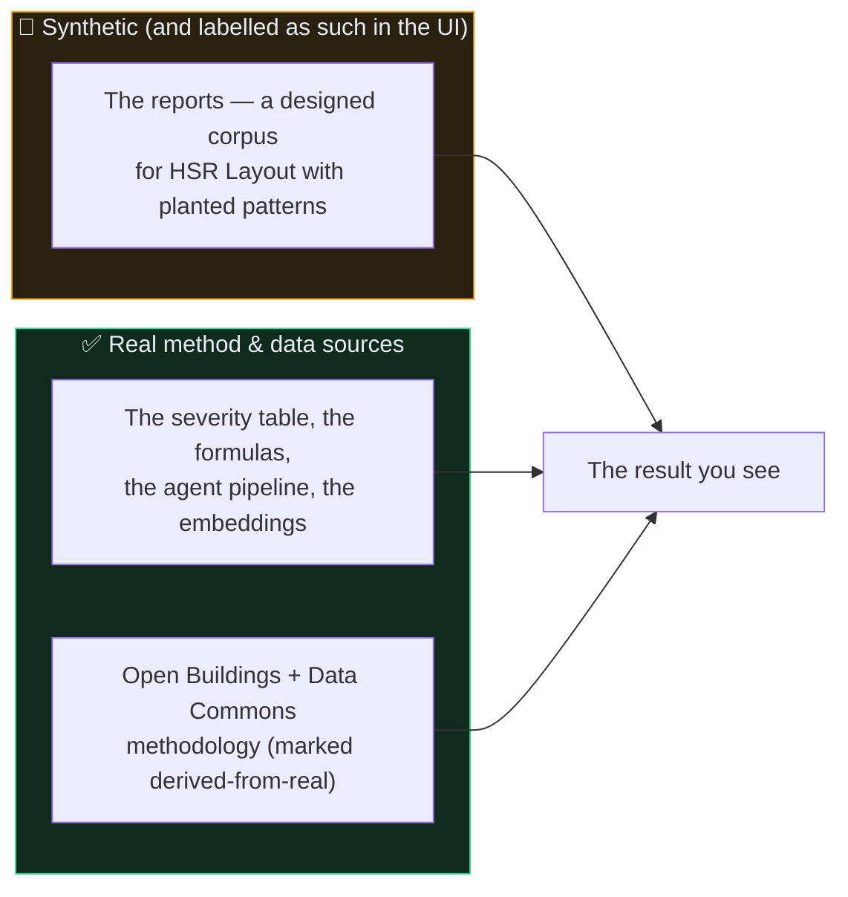

- **The reports are synthetic** — a realistic, hand-designed corpus carrying
  deliberately planted patterns (the hidden crises, a recurrence chain, the
  loud-but-low-impact pothole), so the demo is honest and repeatable rather than
  cherry-picked. **The UI says so on every screen.**
- **The method is real** — the formulas, the agent pipeline, the embeddings, and
  the Plus Code grid are exactly what would run on live data.
- **Low-granularity proxies are flagged** (e.g. district-level vulnerability),
  with confidence adjusted accordingly.
- **The demo spends ≈0 quota** — the pipeline runs once and is frozen; the Trace
  view shows, per step, whether it was cached and how much quota was spent (0).

Nothing in the transparency layer invents a number — every value shown is read
straight off the frozen run.

---

## Run it locally

Requires **Node 22+**.

```bash
npm install

# Optional — a Gemini API key only enables /gemini-ping and re-freezing the
# pipeline. The app runs fully on the committed frozen data without one.
echo "GEMINI_API_KEY=your-key" > .env

npm run dev      # http://localhost:5173
```

> **Windows + OneDrive note:** `npm run dev` uses `node --watch`, which can
> restart-loop inside a OneDrive-synced folder (sync re-touches files). If that
> happens, run the stable variant:
> `node --env-file=.env --import tsx server.ts`.

### Production

```bash
npm run build    # vite build + esbuild server → dist/server.cjs
npm start        # serves dist/ on $PORT
```

### Scripts

| Script | What it does |
|--------|--------------|
| `npm run gate` | typecheck + production build (the CI gate). |
| `npm run agents` | Re-run and re-freeze the 7-agent trace (needs a key). |
| `npm run seed:all` | Regenerate the full seed pipeline. |
| `npm test` | Vitest. |

---

## API

| Endpoint | Returns |
|----------|---------|
| `GET /api/health` | Liveness. |
| `GET /api/issues` · `/api/issues/:id` | The issue set / one auditable issue. |
| `GET /api/reports` | The raw citizen reports (Stage 0). |
| `GET /api/neighborhood/:ward` | The Digital Twin + Civic Pulse. |
| `GET /api/agent-run` · `/api/agent-run/usage` | The frozen trace / the live quota counter. |
| `GET /api/snapshots/:ward` | The Time Machine frames. |
| `GET /.well-known/agent.json` | The A2A agent card. |

---

<div align="center">

**COMMONS** — finding the crises hidden between the reports.

[Live demo](https://commons-33047220516.asia-southeast1.run.app) · [MIT License](./LICENSE)

</div>
